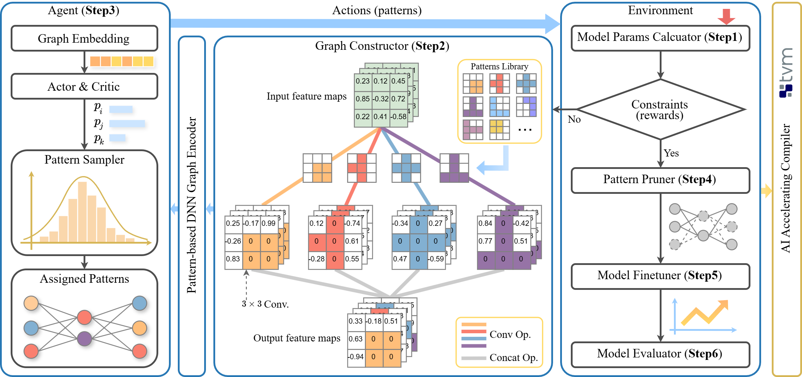

<div align="center">
<h2>Towards Any Structural Pruning</h2>

</div>

AutoSculpt, a pattern-based automated pruning framework designed to enhance efficiency 
and accuracy by leveraging graph learning and deep reinforcement learning (DRL).

## Installation

The main packages we used are as follows:

- python == 3.9.19
- pytorch == 2.1.0
- torchvision == 0.16.0
- torch-geometric == 2.5.0

You can install all needed dependencies by running the following command:

```shell
pip install -r  requirements.txt
```

## Pattern pruning

### DNN pre-training

Firstly, we need to train a DNN from scratch and obtain pretrained weights. For example, we can train the ResNet-110
on Cifar-10 by running:

```shell
python train_dnn.py --model resnet110 --dataset cifar10 --batch_size 512 
```

### DNN pruning

Next, we prune the DNN using pretrained weights.

```shell
python rl_pruning.py --model resnet110 --compress_ratio 0.55 --test_ratio 0.5
```

## Fine tuning

```shell
python fine_tune.py --model resnet110 --compress_ratio 0.55 --run_idx 1 --acc 0.8523 --dataset cifar10
```